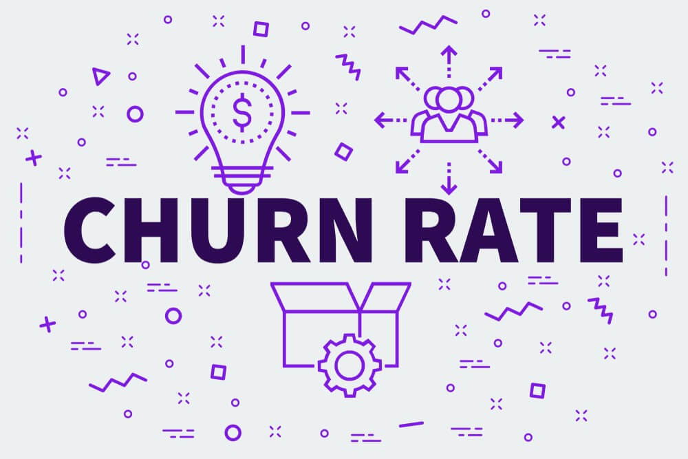

<h1 align = 'center'> Predição de Churn </h1>
</img>

Esse projeto tem como objetivo fazer uma predição sobre a probabilidade de um cliente 
cancelar sua conta no banco. 

<h2> O que é o estado de Churn?</h2>

Conduzir uma empresa ao sucesso é cuidar de cada detalhe. Compreender os motivos pelo qual clientes vem deixando de usar seus serviços ou comprar seus produtos pode ser uma estratégia poderosa e dentro dos negócios de recorrência, a análise de churn é a principal tarefa a ser tratada. 

O estado de Churn pode ser definido de forma correspondente ao modelo de negócio de cada empresa. Basicamente se refere a quantidade de pessoas que não utilizam mais os servis por um determinado período de  tempo. 

A análise de Churn é calculada pela quantidade de pessoas em Churn sobre o total de clientes da empresa. 

<h2>Por que realizar a análise de churn?</h2>

Sabe-se que para uma empesa é muito mais vantajoso manter um cliente do que trazer novos assinantes. Trazer novos clientes também é um ponto importante, no entanto, é muito mais custoso do que manter aqueles que já estão na empresa.

Mas quando muitos clientes decidem fazer o desligamento, problemas como a perda de receita pode trazer muitos problemas.

Desse modo estratégias devem ser realizadas com o intuito de buscar a satisfação de seus clientes e impedindo que essa taxa de desligamento seja alta.

<h2></h2>